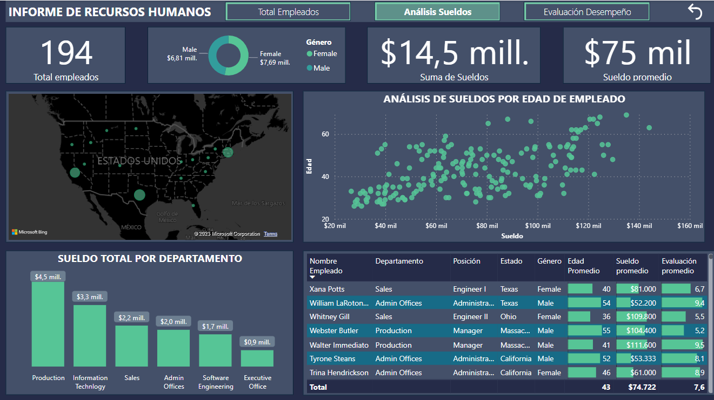
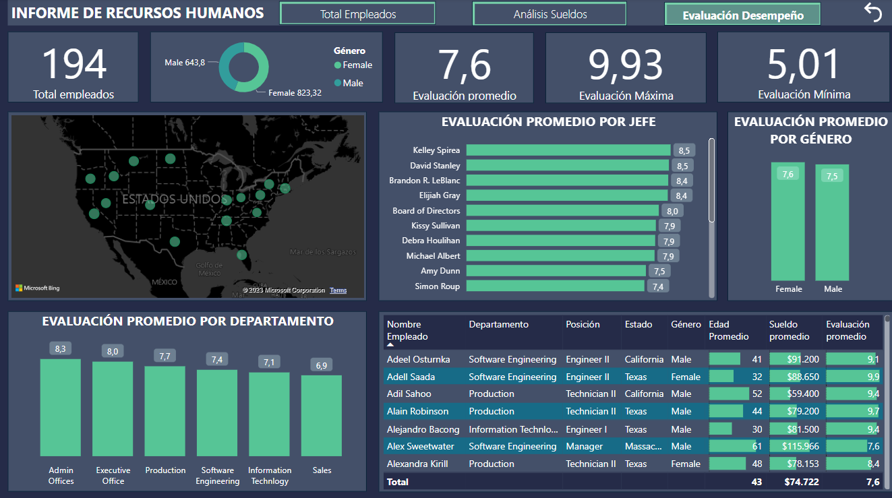

# 🌍 Desglosando Nuestra Fuerza Laboral con Power BI: Recursos Humanos en Acción 📊

#### 👤 Autor: [Alex Marzá Manuel](https://github.com/AlexCapis)

## 📝 Introducción

Este proyecto se centra en un análisis exhaustivo del departamento de Recursos Humanos de una empresa. A través del poderoso marco de trabajo de Power BI, exploramos y visualizamos datos clave relacionados con los empleados, sueldos y evaluaciones.

### Objetivo del Proyecto

El objetivo principal de este proyecto es proporcionar una comprensión profunda y significativa de la composición de la fuerza laboral de la empresa. Al desglosar los datos de los empleados, sus sueldos y evaluaciones, se busca obtener información valiosa que pueda respaldar la toma de decisiones informadas en la gestión de recursos humanos.

## 🚀 Descripción general

El análisis y la comprensión de una fuerza laboral son fundamentales para la gestión eficaz de cualquier empresa. Este proyecto se centra en explorar y visualizar datos relacionados con los empleados de una organización. 

### Páginas del Informe

1. **Total de Empleados**: Brinda una visión general del número total de empleados, su distribución por género, edad promedio, sueldo promedio y evaluación promedio.

2. **Análisis de Sueldos**: Se enfoca en analizar la estructura salarial, incluyendo el sueldo promedio, sueldo por departamento y sueldo en relación a la edad de los empleados.

3. **Evaluación de Desempeño**: Explora la evaluación de los empleados, identificando tendencias y patrones relacionados con el desempeño.

Este proyecto no solo presenta visualizaciones informativas, sino que también demuestra cómo Power BI puede ser una herramienta poderosa para el análisis de datos y la generación de información valiosa para la toma de decisiones en el ámbito de los recursos humanos.

## 📋Requisitos Previos

Antes de comenzar con este proyecto, es fundamental asegurarse de contar con los siguientes elementos:

- **Power BI**: Este proyecto se desarrolla utilizando Power BI como la herramienta principal para la visualización de datos. Si aún no tienes Power BI instalado en tu sistema, puedes descargar la versión más reciente de Power BI Desktop haciendo clic [aquí](https://powerbi.microsoft.com/es-es/desktop/).

- **Conjuntos de Datos**: Para poder llevar a cabo el análisis y las visualizaciones pertinentes, necesitarás disponer del conjunto de datos `Datos+Empleados.xlsx` disponible en la carpeta [data](https://github.com/AlexCapis/Recursos-Humanos-PowerBI/tree/main/data) del repositorio

## 📂 Estructura de carpetas

Para una fácil navegación, he organizado el repositorio de la siguiente manera:

- [data](https://github.com/AlexCapis/Recursos-Humanos-PowerBI/tree/main/data): Contiene los archivos relacionados con los datos utilizados en el proyecto de Power BI.

    - `RECURSOS HUMANOS.pbix`: El archivo de Power BI que contiene el proyecto con las visualizaciones y el análisis.
    - `Datos+Empleados.xlsx`: El conjunto de datos original en formato Excel que se utiliza en el proyecto que alberga los países y continentes.

- [docs](https://github.com/AlexCapis/Recursos-Humanos-PowerBI/tree/main/docs): Almacena documentos y recursos relacionados con la documentación del proyecto.

    - `images`: Una carpeta que almacena las imágenes y gráficos utilizados en el proyecto.
    - `Power+BI+Color+Theme+-+University+of+Melbourne.json`: Se trata de la plantilla empleada en el desarrollo del informe.

- [notebooks](https://github.com/AlexCapis/Recursos-Humanos-PowerBI/tree/main/notebooks): Contiene archivos de cuadernos Jupyter relacionados con el proyecto de Power BI.

    - `explicacion_indicadores_mundiales.ipynb`: Un cuaderno que incluye una explicación detallada del proyecto.

- `.gitignore`: Un archivo que especifica qué archivos o carpetas deben ser ignorados por Git al realizar seguimiento de cambios.

## 📹 Demostración en Video

Antes de sumergirse en los detalles, echa un vistazo a la demostración en video que te guiará a través de las funcionalidades clave de este proyecto en Power BI. ¡Haz clic en la imagen para ver el video!

## ⚙️ Configuración de los Datos

En este proyecto, se realizó un análisis exhaustivo y una transformación detallada del conjunto de datos utilizando el editor de Power Query en Power BI. Esta etapa fue esencial para preparar los datos y obtener la estructura adecuada para su posterior visualización. A continuación, se detallan las principales transformaciones y manipulaciones realizadas:

1. **Transformación de la Tabla de Empleados**:
   - Ajuste de la columna de **Nombre Empleado**: Se invirtió el orden del nombre y apellido, inicialmente listados como apellido seguido de nombre.
   - Modificación del formato de la columna de **Nacimiento**: Se cambió la visualización de fechas de una representación numérica (por ejemplo, "16/12/1975") a un formato más legible (por ejemplo, "martes, 16 de diciembre de 1975").
   - Creación de la columna **Edad**: Se derivó una nueva columna llamada **Edad** que refleja la edad actual de cada empleado.
   - Agrupación de edades en la columna **Grupo Edad**: Se creó esta columna para clasificar a los empleados en rangos de edad específicos para una mejor visualización y análisis.

2. **Transformación de la Tabla de Sueldos**:
   - Creación de la columna **Grupo Sueldo**: Se generó una nueva columna que categoriza los sueldos en grupos para facilitar su representación y comparación.

3. **Transformación de la Tabla de Evaluaciones**:
   - Creación de la columna **Grupo Evaluación**: Se generó una nueva columna que categoriza las evaluaciones para un análisis más claro y efectivo.

Estas transformaciones permitieron una interpretación más eficaz y una representación visual clara de los datos. Todo ello contribuye a obtener visualizaciones dinámicas y comprensibles para el usuario.

## 📌 Conclusiones Clave

Durante el proceso de análisis y visualización de los datos del departamento de Recursos Humanos, se han obtenido diversas conclusiones y puntos clave que proporcionan una visión clara y valiosa del estado actual de la organización. A continuación, se resumen las conclusiones más destacadas:

1. **Perfil Demográfico de la Organización**:
   - Se observa una distribución más o menos equilibrada de empleados por género, lo cual puede indicar una política de igualdad de género efectiva en la empresa.

2. **Estructura Salarial**:
   - La mayoría de los empleados se encuentran en el rango salarial de 60,000 a 80,000, lo que puede sugerir una política de remuneración competitiva.

3. **Evaluación de Desempeño**:
   - Se destaca que la mayoría de los empleados tienen una evaluación promedio en el rango de 7 a 8, indicando un nivel general de desempeño adecuado en la organización.

4. **Distribución por Edades**:
   - La mayor concentración de empleados se encuentra en el rango de 30 a 40 años, lo que puede implicar una organización con una fuerza laboral relativamente joven.

5. **Análisis Geográfico**:
   - A través del mapa interactivo, se puede identificar que ciertas regiones tienen una mayor densidad de empleados, lo que puede sugerir oportunidades de expansión en esas áreas.

Estas conclusiones proporcionan información valiosa que puede guiar la toma de decisiones estratégicas en el departamento de Recursos Humanos y en la organización en su conjunto. Es esencial tener en cuenta estas conclusiones al planificar estrategias futuras y mejorar la eficiencia y efectividad de la organización.

## 🙏 Agradecimientos

Espero que este proyecto te resulte útil y te sirva de ayuda. ¡Explora las visualizaciones y datos, y siéntete libre de utilizar esta información para tomar decisiones informadas!
